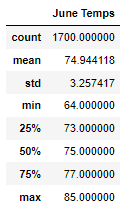
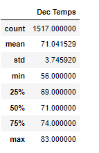

# surfs_up
## Overview of Analysis
The purpose of this project was to analyze weather data in Oahu for the months of June and December. The results of this analysis would help determine if an ince cream / surf shop should be open all year round.

## Results
Below are some of the results from the analysis
* December temperatures on average (71.0) are lower than June temperatures (74.9),  however not by much only approx. 4 degrees F.
* The minimum temperature recorded for December is significantly lower than any June temperature at 56 degrees vs June low of 64 degrees
* The maximum temperatures in June and December are similar at 83 degrees for December and 85 degrees for June
Below are the completed results

## Summary
Besides a few low days in December, the temperature in December and June are pretty similar. Therefore based on this data, there is no need to close the shop for a month. However, this is likely not enough data to make this decision. The same analysis should be done for December and June preciptiation, if there is more precipitation in one month than the shop may need to be closed. Another query should be done on both temperature and precipitation per month but also by year. To see if the weather is trending in any direction. For example maybe overall (all years of data) the precipitation in December is fine but there could be a trend of more precipitation every year which would mean that in the future there could be more precipitation and therefore influence the decision about when the shop should be open.

